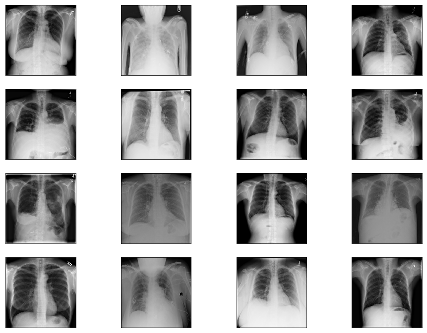
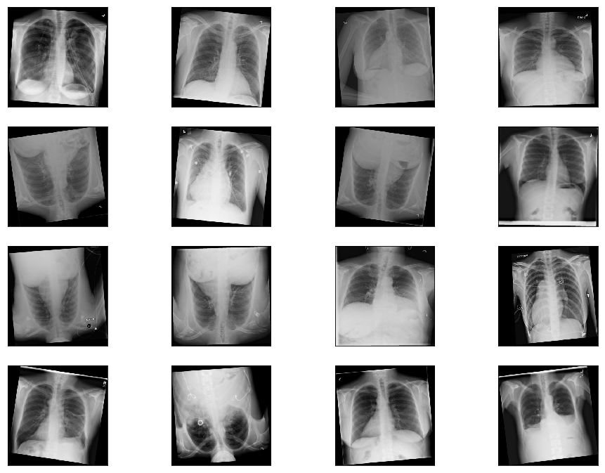
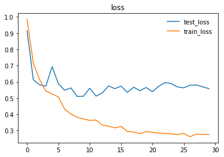
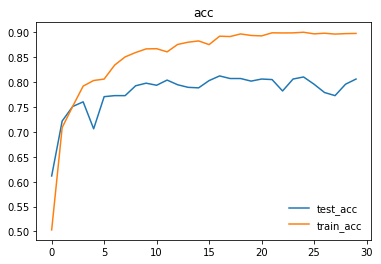

# Disease detection Project using Chest X-ray Database
This project utilizes a new chest X-ray database, namely “ChestX-ray8”, which comprises 108,948 frontal view X-ray images of 32,717 unique patients with the text mined 14 disease image labels (where each image can have multi-labels), from the associated radiological reports using natural language processing.
## Abstract
Chest X-Rays are the most reliable radiobiological imprints of patients, widely used to efficiently diagnose an array of common thoracic diseases. For too long, vast accumulations of image data and their associated diagnoses have been stored in the Picture Archiving and Communication Systems (PACS) of several hospitals and medical institutions. In the meanwhile, data-hungry Deep Learning systems lie in wait of voluminous databases just like these, at the cusp of fulfilling the promise of fully-automated and accurate disease diagnosis. Through this project, we hope to unite one such vast database, the “ChestX-ray8" dataset, with powerful Deep Learning Systems, to automate the diagnosis of 14 common kinds of lung diseases. Currently, we will be focusing on three kinds of diseases to start with. 

## Introduction 
Deep learning, also known as hierarchical learning or deep structured learning, is a type of machine learning that uses a layered algorithmic architecture to analyze data. Unlike other types of machine learning, deep learning has the added benefit of being able to decisions with significantly less involvement from human trainers. While basic machine learning requires a programmer to identify whether a conclusion is correct or not, deep learning can gauge the accuracy of its answers on its own due to the nature of its multi-layered structure. The emergence of modern frameworks like PyTorch, has also made preprocessing of data more convenient. Many of the filtering and normalization tasks that would have been completed manually by human programmers when using other machine learning techniques, are taken up automatically.

The essential characteristics of deep learning make it an ideal tool for giving much needed impetus, to the field of automated medical diagnosis. With the right expertise, it can be leveraged to overcome several limitations of conventional diagnosis done by medical practitioners and take the dream of accurate and efficient disease diagnosis to the realm of reality.

Given the team's vision to make healthcare better for everyone, everywhere, and having paid attention to the trends and recent breakthroughs with deep learning, we decided to use convolutional networks for this project. Recent work has shown that convolutional networks can be substantially deeper, more accurate, and efficient to train if they contain shorter connections between layers close to the input and those close to the output. We embraced this observation, and leveraged the power of the Dense Convolutional Network (DenseNet), which connects each layer to every other layer in a feed-forward fashion. Whereas traditional convolutional networks with L layers have L connections - one between each layer and its subsequent layer - our network had L(L+1)/2 direct connections. For each layer, the feature-maps of all preceding layers are used as inputs, and its own feature-maps are used as inputs into all subsequent layers. Furthermore, we used the resNext50 and resnet50 as controls to validate our choice of DenseNet.

### Precedences for Deep Learning Use for Disease Diagnosis
Convolutional Neural Networks, which form the soul of Deep Learning systems, are designed inherently for image processing, according to computer science experts at Stanford University. This sets them up for handling and gathering insights from large images more efficiently.

Currently, some CNNs are approaching – or even surpassing – the accuracy of human diagnosticians when identifying important features in diagnostic imaging studies. In June of 2018, a study in the Annals of Oncology showed that a convolutional neural network trained to analyze dermatology images identified melanoma with ten percent more specificity than human clinicians.Additionally, researchers at the Mount Sinai Icahn School of Medicine have developed a deep neural network capable of diagnosing crucial neurological conditions, such as stroke and brain hemorrhage, 150 times faster than human radiologists. The tool took just 1.2 seconds to process the image, analyze its contents, and alert providers of a problematic clinical finding.

Evidently, there is very good potential for the future of healthcare with smart tools which integrate deep learning.

### Potential Benefits Of Deep Learning in Healthcare?
Among the several benefits artificial intelligence promises to bring to healthcare, these are worth highlighting.
  * **More affordable treatment:** Diagnosis is faster and more accurate with automation; doctors will be able to recommend the right treatments to patients or intervene appropriately before illnesses aggravate to require more expensive treatment options.
  * **Safer solutions:** More accurate diagnosis means there’s a lower risk of complications associated with patients receiving ineffective or incorrect treatment.
  * **More patients treated:** By reducing the time it takes to complete a diagnosis, laboratories can perform more tests. This will lead to coverage for more patients in much lesser time. 
  * **Addressing the global ‘Physician Shortage’:** This is a growing concern in many countries around the world, due to a growing demand for physicians that outmatches the supply. The World Health Organization (WHO) estimates that there is a global shortage of 4.3 million physicians, nurses, and other health professionals. The shortage is often starkest in developing nations due to the limited numbers and capacity of medical schools in these countries. Additionally, rural and remote areas also commonly struggle with a physician shortage the world over. Obviously, the growing need for more qualified medical personnel worldwide is like an incomplete jigsaw puzzle and deep Learning systems have the potential to solve this puzzle once and for all.

There is no denying the fact that with an ever-growing global population, we are going to need alternative AI-based medical personnel to assist us in achieving the sustainable development goal of providing “**A**ffordable, **A**ccurate and **A**dequate Healthcare for All”.

This project is borne out of the team's vision to make healthcare better for everyone, anywhere.

## Methodology

Given our time constraint, we chose to divide ourselves into sub-teams corresponding to the demarcated phases of this project. The benefit of this approach was a smooth iterative process - where we could have quick adjustments from previous phases to facilitate better outcomes for a subsequent phase - and speed due to parallel implementations at the various phases.
We also adopted a scrum model, where the entire period was a sprint, and stand-up sessions within at most 2-day intervals served for a progress update and team re-orientation where it was necessitated.
Finally, our team model allowed us to use initial cycles as an exploration to inform our final data, preprocessing and model strategies. With each cycle, we redefined our goals while maintaining the general objective of facilitating faster lung X-ray assessments. 

### Sampling

The dataset was highly imbalanced, a high value in the distribution of 60361 and low of 110, and huge in size for our timeline and we had to resort it to using a well-represented sample. We eventually scaled down on the dataset to [12000] from [112000]. 

Sample images from the original dataset are as below:

The initial distribution for images with single class labels is given below.

Labels | Distributions
------------ | -------------
No Finding | 60361
Infiltration | 9547
Atelectasis | 4215
Effusion | 3955
Nodule | 2705
Pneumothorax | 2194
Mass | 2139
Consolidation | 1310
Pleural_Thickening | 1126
Cardiomegaly | 1093
Emphysema | 892
Fibrosis | 727
Edema | 628
Pneumonia | 322
Hernia | 110

We initially tested our strategies for classifying all 15 conditions and redefined our goals through exploration, until in addition to identifying Healthy X-rays (No Finding), the model could more accurately classify two conditions, Cardiomegaly and Effusion.

For our final round, and based on clinical considerations, we proceeded with two sets:
* Version 4.1 - for images taken using both antero-posterior position (AP) and postero-anterior position (PA).
* Version 4.2 - containing images taken using PA for Effusion and healthy (No finding) classes, and AP and PA for cardiomegaly. 

The exception was made for the latter due to inadequate PA images.

The distribution for Version 4.1 finally settled at:
* (AP + PA) Cardiomegaly – 1093
* (AP + PA) No Finding – 1500
* (AP + PA) Effusion - 1500

The distribution for Version 4.2 finally settled at:
* (AP + PA) Cardiomegaly – 1093
* (PA) No Finding – 1500
* (PA) Effusion - 1500

### Preprocessing
Given that our dataset covered medical conditions, the manifestations of which could be present at edges of X-ray images, we exercised caution with our transformations. After several deliberations and clinical considerations, we resorted to avoiding cropping and extreme random rotations and kept to these:
* Random Rotation: within the angle range -10 to 10, with expansion enabled
* Resize: to a size of 224 by 224 to match our densenet model input size
* Random Horizontal Flip
* Random Vertical Flip
* Conversion To Pytorch floatTensor type: This minimalistic approach was our shot at preserving as much information that would be clinically relevant for diagnosing our target conditions.

Sample images from the transformed dataset are as below:

### Modeling
The modeling stage was characterized by several iterative cycles that called for new sampling and processing strategies on demand. Notwithstanding, the team model facilitated swift responses so that we could re-orient quickly without disrupting overall progress.
We also had the technical expertise that allowed us to try novel activation functions - namely mila, mish and beta mish – which we believe contributed greatly to our results, in addition to hyperparameter tunings.

> Activation functions are an extremely important feature of the artificial neural networks. They basically decide whether a neuron should be activated or not. Whether the information that the neuron is receiving is relevant for the given information or should it be ignored.

#### **β-Mish** 
It is an uni-parametric activation inspired by the Mish activation function - when β=1, β-Mish becomes the standard version of Mish - and can be mathematically represented using the function:

If β=1.5, the function ranges from  ≈-0.451103 to ∞. For most benchmarks, β was set to be 1.5.

#### **Mila** 
It is an uniparametric activation function inspired by the Mish Activation Function. The parameter β is used to control the concavity of the Global Minima of the Activation Function where β=0 is the baseline Mish Activation Function. Varying β in the negative scale reduces the concavity and vice versa. β is introduced to tackle gradient death scenarios due to the sharp global minima of Mish Activation Function.

The mathematical function of Mila is shown as below:

#### **SQNL activation** 
This activation function uses the square operator to introduce the required non-linearity as compared with the use of an exponential term in the popular TanSig. Smaller computational operation count characterizes the proposed activation function. The key to the effectiveness of this function is a faster convergence when used in Multilayer Perceptron Artificial Neural Network architectural problems. Besides, the derivative of the function is linear, resulting in a quicker gradient computation.

#### **ReLU activation** 
ReLu Stands for Rectified linear unit. It is the most widely used activation function. Chiefly implemented in hidden layers of Neural network.
* Equation :- A(x) = max(0,x). It gives an output x if x is positive and 0 otherwise.
* Value Range :- [0, inf]
* Nature :- Non-linear, which means we can easily backpropagate the errors and have multiple layers of neurons being activated by the ReLU function.
* Uses :- ReLu is less computationally expensive than tanh and sigmoid because it involves simpler mathematical operations. At a time only a few neurons are activated making the network sparse making it efficient and easy for computation.

#### **Softmax activation**
The softmax function is also a type of sigmoid function but is handy when we are trying to handle classification problems.
* Nature :- non-linear
* Uses :- Usually used when trying to handle multiple classes. The softmax function would squeeze the outputs for each class between 0 and 1 and would also divide by the sum of the outputs.
* Ouput:- The softmax function is ideally used in the output layer of the classifier where we are actually trying to attain the probabilities to define the class of each input.

> Deep Convolutional Neural Network (DCNN) architectures are used for weakly-supervised object localization, by considering large image capacity, various multi-label CNN losses and different pooling strategies. We are using these architectures to design models for training Chest X-ray Datasets in multiple combinations with above mentioned activation functions. 

#### **densenet 161**
A DenseNet is a stack of dense blocks followed by transition layers. Each block consists of a series of units. Each unit packs two convolutions, each preceded by Batch Normalization and ReLU activations. Besides, each unit outputs a fixed number of feature vectors. This parameter, described as the growth rate, controls how much new information the layers allow to pass through.

On the other hand, transition layers are very simple components designed to perform downsampling of the features passing the network. Every transition layer consists of a Batch Normalization layer, followed by a 1x1 convolution, followed by a 2x2 average pooling.

#### **resnet50**
Deep residual network (deep ResNet) is a type of specialized neural network that helps to handle more sophisticated deep learning tasks and models. It has received quite a bit of attention at recent IT conventions, and is being considered for helping with the training of deep networks. ResNet-50 is a convolutional neural network that is trained on more than a million images from the ImageNet database [1]. The network is 50 layers deep and can classify images into 1000 object categories, such as keyboard, mouse, pencil, and many animals. As a result, the network has learned rich feature representations for a wide range of images. The network has an image input size of 224-by-224. For more pretrained networks in MATLAB. 

In deep learning networks, a residual learning framework helps to preserve good results through a network with many layers. One problem commonly cited by professionals is that with deep networks composed of many dozens of layers, accuracy can become saturated, and some degradation can occur. Some talk about a different problem called "vanishing gradient" in which the gradient fluctuations become too small to be immediately useful.

The deep residual network deals with some of these problems by using residual blocks, which take advantage of residual mapping to preserve inputs. By utilizing deep residual learning frameworks, engineers can experiment with deeper networks that have specific training challenges.

#### **resNext50**
ResNeXt is a simple, highly modularized network architecture for image classification. Our network is constructed by repeating a building block that aggregates a set of transformations with the same topology. Our simple design results in a homogeneous, multi-branch architecture that has only a few hyper-parameters to set. This strategy exposes a new dimension, which we call “cardinality” (the size of the set of transformations), as an essential factor in addition to the dimensions of depth and width.

### Encryption of model and dataset
Healthcare data is particularly sensitive and if we face the risk of exposing sensitive patient data. For ensuring security and privacy of the dataset, we have implemented encrypted learning. To ensure encryption of model is done on demand and portability of classes we have implemented this in the below manner.
* We encrypt patient data before it reaches our model. 
* We make the model available as a service, and we protect our intellectual rights, as regards the gradients and model parameters.

Below are the configurations to achieve the above two cases
* Name Of Class: ModelEncryptor
* Attributes: shares(shareholders), model(encrypted model)
* Methods: encrypt_data(encrypts image data to be classified), predict(classifies the image)

## Results
With varied approaches for data sampling, activation function selection and hyperparameter tuning, we trained and tested six models, codenamed Aurora, Ava, Auden, Venus, Armadillo, and Atlas. Our results are given below in descending order of model performance.

### *AURORA:* beta-mish, mila and densenet 161 --> 82.3%
We trained and tested densenet161 with beta-mish and mila activations, on classifying Cardiomegaly, Effusion, and No Finding, irrespective of X-ray position using dataset version 4.2.

Label | Accuracy
------------ | -------------
Cardiomegaly | 89.000% (89/100)
Effusion | 83.000% (83/100)
No Finding | 75.000% (75/100)
Overall | 82.3333% (247/300)

Here are the graphs representing  loss and accuracy for  test and training dataset. 
   

### *AVA:* beta-mish and densenet 161 --> 79.3%
We trained and tested densenet161 with beta-mish and mila activations, on the dataset version 4.1 containing images for Cardiomegaly(mixed AP/PA), Effusion(PA), and No-Finding(PA)

Label | Accuracy
------------ | -------------
Cardiomegaly | 83.000% (83/100)
Effusion | 79.000% (79/100)
No Finding | 76.000% (76/100)
Overall | 79.3333% (238/300)

### *AUDEN:* densenet161, sqnl activation --> accuracy 75.59%
We trained and tested densenet161 with sqnl activation, on classifying Emphesyma and No-Finding, irrespective of X-ray position.

Label | Accuracy
------------ | -------------
Emphysema | 70% (70/100)
No Finding | 80% (76/100)

### *VENUS:* resnet50, mila activation --> accuracy 68.54%%
We trained and tested resnet50 with mila activation, on classifying Pneumothorax and No-Finding, irrespective of X-ray position.

Label | Accuracy
------------ | -------------
Pneumothorax | 45% (45/100)
No Finding | 92% (92/100)

### *ARMADILLO:*  densenet161, mila activation --> accuracy 61.932%
We trained and tested densenet161 with mila activation on classifying Cardiomegaly, Effusion, and No-Finding, irrespective of X-ray position.

Label | Accuracy
------------ | -------------
Cardiomegaly | 25%
Effusion | 80%
No Finding | 66%

### *ATLAS:* resNext50, traditional ReLU + Softmax combination --> accuracy 47%
We trained and tested resNext50 with traditional ReLU and Softmax activations on classifying Cardiomegaly, Effusion, and No-Finding, irrespective of X-ray position.

Evidently, our most accurate model was *AURORA*, achieving an accuracy of 82.3%, on PA images for Effusion and Healthy X-rays(No-finding), and AP+PA images for cardiomegaly.

## Discussion
We ran into significant difficulties in our attempt to find a working approach towards processing the Chest X-Ray dataset and training a successful deep learning model. While many factors can be taken into account for this complication, the root cause can be traced back to the original dataset itself, which contains many imperfections and deficiencies that posed numerous challenges for the Data Acquisition, Pre-processing and Modelling teams alike. 

All of those shall be explored and clarified in-depth for our readers in this section, and the limitations we came across will be covered in the next section.
* **Chest X-Ray dataset is extremely imbalanced when it comes to the distribution of the number of instances for each class**: _For example,_ there is a huge disparity between the number of the top class – No Finding with more than 60,000 instances and the bottom one – Hernia with a mere 110 instances. 
        This created a difficult situation for us where we had to make a decision on how we should further process and transform our data before feeding to the model.
  
* **X-ray images in our dataset were taken from two different positions: PA/posterior-anterior and AP/anterior-posterior**: This especially held true for “Effusion” class, with the number of images captured in each position almost equal. Since many of the diseases in our dataset were sensitive to such positions, we debated on whether we should split each class into two smaller ones: AP and PA or more ideally, only retain PA pictures.  
The latter approach, nevertheless, had one major disadvantage: we need to take into account the number of pictures in the PA position, which in many cases, there were simply not enough of them. In the end, considering the limited number of PA images we had for “cardiomegaly”, we decided to include both PA and AP pictures in each class, and this would definitely have a negative impact on the accuracy of our model.

* **How we should proceed with data augmentation**: 
Given the nature of X-ray images for lung diseases, even a small rotation or central cropping could end up leaving out important diagnosis information and lead to the difficulty of generalization. Having researched extensively to gain a deep understanding of the images, the size of our dataset, and the reported performance of past models, after lengthy discussions and countless trial and error attempts, we finally came to an agreement: reduce the number of classes in the wrangled and modified dataset to only 3: CardioMegaly, Effusion, and No finding, with the number of sampled instances for each class, became much more balanced and therefore prevented biases from occurring when being trained by the model.

* **X-ray images in the dataset were missing some crucial information typically used for diagnosing diseases**: 
After consulting with the subject matter expert Olivia in our team, we found that in particular, for conditions that tend to look similar in X-ray images such as “Mass”, “Infiltration” and “Pneumonia”, in real life doctors would rely on other factors such as white count and temperature to make a formal diagnosis. Unfortunately, that information was not available in our dataset, which in turn can be problematic for whatever deep learning model being trained and deployed to classify conditions. In fact, in the original paper, all the aforementioned diseases performed poorly and recorded a high prediction error rate from the model, which helped to reinforce our earlier finding.

* **Disease labels for the X-ray chest dataset were not done manually, but rather through a number of different NLP techniques when constructing the image database**: 
Although the authors have gone the extra mile to mitigate the risk of wrong labeling by crafting a variety of custom rules and then applying them in the pre-processing step, the problem of defective labels was not entirely eliminated. Specifically, we can refer to “Table 2. Evaluation of image labeling results on OpenI dataset.” on page 4 of the paper for a detailed assessment on this phenomenon. The vast majority of classes exhibit varying degrees of being mislabeled, from Effusion with 0.93 precision rate to Infiltration with a modest score of 0.74. As a consequence, this has considerably limited our model’s ability to train on the dataset and later classify disease labels with great accuracy, given that the data was not without flaw, right from the beginning.

## Limitations
Few Limitations that we found while working on this project one of them explained in above discussions:
* Negative impact on the accuracy of our model due to the inclusion of both PA and AP pictures in each class.
* For data augmentation, we need an alpha(Fluorescence) channel to avoid dismissal of key info which was creating difficulty of generalization. So we reduced to 3 classes and modified the dataset to prevent biases from occurring when being trained by the model.
* Considering the picture quantities we have for cardiomegaly, we decided to still include both AP and PA pictures. This may lower the accuracy of our model.

## Conclusion
Our project adds emphasis to the immense potential to be harnessed from the intersection of Deep Learning and Medical Diagnostics. The outcomes achieved within the short span of time were commendable. We also appreciated the technicalities of medical imaging, and more importantly, the challenges with automated diagnosis leveraging analysis of x-ray images by deep neural networks.
Our goal is to build a full system that leverages federated learning and full blown secure and privacy preserving technologies, to make smart diagnosis accessible in the browser, on phones and tablets - the web interface is up and functional, while the mobile platforms are underway. We have also designed a roadmap which will allow us to improve the overall quality and accuracy of our system on available datasets for chest X-rays. Ultimately, we hope to build on this project for other diagnoses outside our current target of 14 lung conditions.

## Recommendations
The team would like to extend the project to institutions where aid to diagnosis is of utmost importance. 
* Currently, the project is limited to the public domain dataset and to the best-effort analyses of health records via natural language processing. The idea here is to improve the current accuracy of the model by augmenting it with real-world datasets which are available from medical institutions. 
* Due to the sensitive nature of these datasets and with intentions of privacy, naturally, these are currently being kept private. With the power of federated learning, we can adopt a strategy where medical institutions would not need to relent their private datasets to a central server, which might lead to privacy leakage. Instead, we open an interface for them to feed the data within the institution, train the model on-site and only transmit gradients and other model information to the central server which we have access and do model aggregation accordingly. 
* Firstly, we coordinate with medical institutions to install Internet-enabled devices on-premise. For this, we think of Raspberry Pi 3 devices, small, lightweight and powerful enough to do the tasks we need for local training. We plan on creating a headless setup to each Raspberry Pi devices with web server connected on their local network. This web server can be accessed by representatives in-house to feed X-ray data and other relevant information pertinent to local training. We make sure that the data to be fed to locally matches the global requirements for model improvement. 
* We can send the model definition to each Raspberry Pi’s installed remotely. We then orchestrate model updates on-demand using the power of PySyft’s secure model parameter aggregation, leveraging mathematical techniques per actor to encrypt model information so trusted aggregators cannot glean on raw gradients sent by federated nodes.
Of course, there needs to be full coordination with hospitals, clinics and radiologic facilities who have quality datasets to join in our planned IoT-enabled space specifically for this use case. In return, we enable an intuitive interface to help doctors in diagnosis. 
* For improving encrypted deep learning in this project, we would try to improve and tweak class where we can customize precision.

## Appendix
https://colab.research.google.com/drive/1nub56-UfvlovgWP7oSC5850HdNIbOFQu 

## Collaborators
Members | Slack Handle
------------ | -------------
Victor Mawusi Ayi | @ayivima
Anju Mercian | @Anju Mercian
George Christopoulos | @George Christopoulos
Ashish Bairwa  | @Stark
Pooja Vinod | @Pooja Vinod
Ingus Terbets | @Ingus Terbets
Alexander Villasoto | @Alexander Villasoto
Olivia Milgrom | @Olivia
Tuan Hung Truong | @Hung
Marwa Qabeel | @Marwa
Shudipto Trafder | @Shudipto Trafder
Aarthi Alagammai | @Aarthi Alagammai
Agata | @Agata [OR, USA]
Kapil Chandorikar | @Kapil Chandorikar
Archit | @Archit
Cibaca Khandelwal | @cibaca
Oudarjya Sen Sarma | @Oudarjya Sen Sarma
Rosa Paccotacya | @Rosa Paccotacya

## References

https://arxiv.org/pdf/1705.02315.pdf

http://openaccess.thecvf.com/content_cvpr_2017/papers/Huang_Densely_Connected_Convolutional_CVPR_2017_paper.pdf

https://www.kaggle.com/ingusterbets/nih-chest-x-rays-analysis

https://github.com/digantamisra98/Mila

https://github.com/digantamisra98/Beta-Mish

https://nihcc.app.box.com/v/ChestXray-NIHCC/folder/37178474737

https://nihcc.app.box.com/v/ChestXray-NIHCC/file/219760887468

https://link.springer.com/chapter/10.1007/978-3-540-75402-2_4

https://openreview.net/pdf?id=rkBBChjiG

https://arxiv.org/pdf/1711.05225

